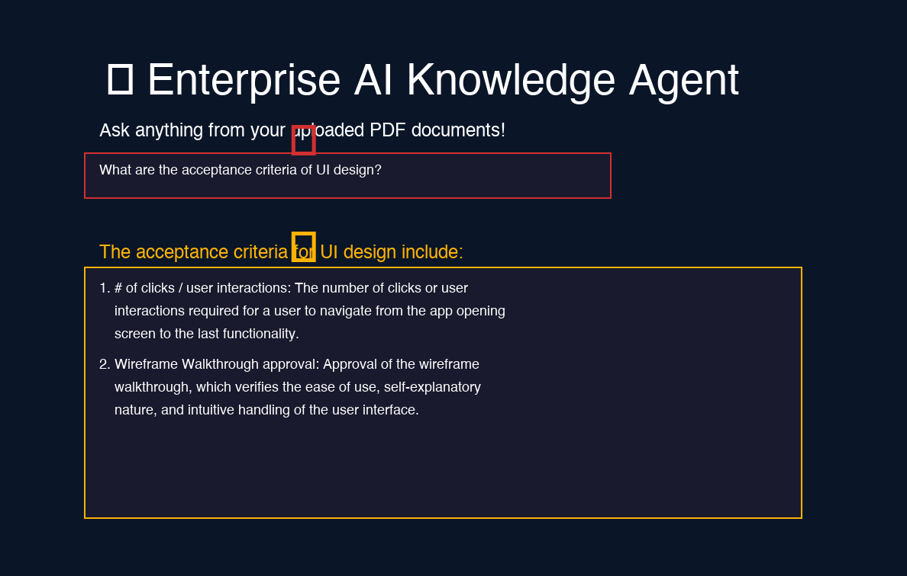

# 🤖 Enterprise AI Knowledge Agent

> **A Powerful Retrieval-Augmented Generation (RAG) System for Intelligent Document Processing**

**Developed by:** Muhammad Hafeez | AI Engineer

---

## 📋 Table of Contents

1. [Overview](#overview)
2. [Key Features](#key-features)
3. [Architecture](#architecture)
4. [Technology Stack](#technology-stack)
5. [Core Technologies Explained](#core-technologies-explained)
6. [Project Structure](#project-structure)
7. [Installation & Setup](#installation--setup)
8. [How to Use](#how-to-use)
9. [Advanced Features](#advanced-features)
10. [Screenshots](#screenshots)
11. [Troubleshooting](#troubleshooting)
12. [Developer Info](#developer-info)

---

## 🎯 Overview

**Enterprise AI Knowledge Agent** is an enterprise-grade **Retrieval-Augmented Generation (RAG)** system designed to intelligently extract, process, and retrieve information from PDF documents. It enables organizations to build intelligent document-based AI assistants that can answer complex questions with contextual accuracy.

The system combines cutting-edge NLP technologies with a user-friendly Streamlit interface, making it accessible to both technical and non-technical users.

### What Makes It Enterprise-Ready?

- ✅ **Multi-document processing** - Handle multiple PDFs simultaneously
- ✅ **Persistent memory** - Maintain conversation context across sessions
- ✅ **Semantic search** - Find relevant information with high precision
- ✅ **Scalable architecture** - Built for production deployment
- ✅ **Easy deployment** - Streamlit-based web interface

---

## ⭐ Key Features

### 1. **PDF Document Upload & Processing**
- Upload multiple PDF documents in a single session
- Automatic text extraction and chunking
- Batch processing for efficiency
- Support for complex PDFs with images and tables

### 2. **Intelligent Semantic Search**
- Convert natural language queries to semantic vectors
- Find document sections most relevant to user questions
- Returns top-K matching documents (configurable, default: 3)
- Cosine similarity-based ranking

### 3. **Conversational AI with Memory**
- Multi-turn conversations with context awareness
- Session-based chat history tracking
- Maintains conversation thread automatically
- Follow-up questions work with previous context

### 4. **Advanced RAG Pipeline**
- Query embedding using OpenAI embeddings
- ChromaDB vector similarity search
- Context augmentation for LLM prompts
- GPT-4o-mini for intelligent response generation

### 5. **Vector Database Integration**
- ChromaDB for fast similarity search
- Efficient storage of document embeddings
- Metadata tracking for document lineage
- Scalable storage architecture

### 6. **Enterprise Security**
- API key protection via environment variables
- Session isolation
- No data persistence on disk
- HTTPS-ready for cloud deployment

### 7. **User-Friendly Interface**
- Intuitive Streamlit web UI
- Real-time response generation
- Query history display
- Error handling with helpful messages

### 8. **Flexible Customization**
- Adjustable retriever parameters (k-value)
- Configurable LLM temperature
- Custom system prompts
- Extensible architecture

---

## 🏗️ Architecture

### RAG Pipeline Flow

```
┌─────────────────────────────────────────────────────────────┐
│                   User Query Input                           │
└────────────────────────┬────────────────────────────────────┘
                         │
                         ▼
┌─────────────────────────────────────────────────────────────┐
│           Convert Query to Embeddings                        │
│              (OpenAI Embeddings)                             │
└────────────────────────┬────────────────────────────────────┘
                         │
                         ▼
┌─────────────────────────────────────────────────────────────┐
│        Semantic Similarity Search in Vector DB              │
│              (ChromaDB Vector Store)                         │
└────────────────────────┬────────────────────────────────────┘
                         │
                         ▼
┌─────────────────────────────────────────────────────────────┐
│         Retrieve Top-K Document Chunks (k=3)                │
└────────────────────────┬────────────────────────────────────┘
                         │
                         ▼
┌─────────────────────────────────────────────────────────────┐
│    Format Prompt with Retrieved Context +                   │
│    Conversation History + User Query                        │
└────────────────────────┬────────────────────────────────────┘
                         │
                         ▼
┌─────────────────────────────────────────────────────────────┐
│     Send Augmented Prompt to LLM                            │
│           (ChatOpenAI - GPT-4o-mini)                        │
└────────────────────────┬────────────────────────────────────┘
                         │
                         ▼
┌─────────────────────────────────────────────────────────────┐
│          Generate Contextual Response                        │
└────────────────────────┬────────────────────────────────────┘
                         │
                         ▼
┌─────────────────────────────────────────────────────────────┐
│    Store in Session History + Return to User               │
└─────────────────────────────────────────────────────────────┘
```

---

## 🔧 Technology Stack

| Component | Technology | Purpose |
|-----------|-----------|---------|
| **Framework** | LangChain | RAG orchestration |
| **Vector DB** | ChromaDB | Embedding storage & retrieval |
| **Embeddings** | OpenAI API | Text vectorization |
| **LLM** | GPT-4o-mini | Response generation |
| **Web UI** | Streamlit | User interface |
| **PDF Processing** | PyPDF | Document extraction |
| **Environment** | python-dotenv | API key management |

---

## 📚 Core Technologies Explained

### **LangChain Framework**

LangChain is the backbone of this application, providing:

- **Document Loaders**: `PyPDFLoader` extracts text from PDF files
- **Embeddings Integration**: `OpenAIEmbeddings` converts text to vectors
- **Chat Models**: `ChatOpenAI` integrates GPT-4o-mini
- **Message History**: `ChatMessageHistory` maintains conversation state
- **Retrieval Chains**: `RunnableWithMessageHistory` combines retrieval + generation
- **Prompt Templates**: Structured prompts with variable injection

```python
from langchain_community.document_loaders import PyPDFLoader
from langchain_openai import OpenAIEmbeddings, ChatOpenAI
from langchain_core.runnables.history import RunnableWithMessageHistory
from langchain_community.chat_message_histories import ChatMessageHistory
```

### **ChromaDB Vector Database**

ChromaDB is an open-source vector database optimized for AI:

- **Vector Storage**: Efficiently stores 1536-dimensional embeddings
- **Similarity Search**: Uses cosine similarity to find related documents
- **Metadata Support**: Associates documents with source information
- **In-Memory & Persistent**: Flexible storage options
- **Fast Retrieval**: Optimized for low-latency queries

```python
from langchain_chroma import Chroma

# Create vector store
vectorstore = Chroma.from_documents(
    documents=all_docs,
    embedding=embeddings
)

# Retrieve similar documents
retriever = vectorstore.as_retriever(search_kwargs={"k": 3})
```

### **OpenAI Embeddings**

Converts text into semantic vectors:

- **Model**: `text-embedding-3-small`
- **Dimensions**: 1536 numerical values per text
- **Quality**: State-of-the-art semantic similarity
- **Cost**: Affordable at scale
- **Use Case**: Makes documents and queries comparable in vector space

```python
embeddings = OpenAIEmbeddings(api_key=api_key)
```

### **GPT-4o-mini Language Model**

Generates intelligent responses:

- **Model**: GPT-4o-mini (fast and capable)
- **Temperature**: 0 (deterministic, fact-based responses)
- **Input**: Context from documents + conversation history
- **Output**: Accurate, sourced answers

```python
llm = ChatOpenAI(model="gpt-4o-mini", temperature=0)
```

### **Streamlit Web Interface**

User-friendly interface for document upload and queries:

- Real-time response display
- Session-based user management
- File upload handling
- Chat history visualization
- Error handling and logging

---

## 📁 Project Structure

```
Enterprise-AI-Knowledge-Agent/
├── app.py                      # Main Streamlit application
├── frontend.py                 # Frontend components (optional)
├── engine/
│   └── rag_engine.py          # Core RAG engine
├── requirements.txt           # Python dependencies
├── .env.example               # Environment template
├── mypdftemplate.pdf          # Sample PDF for testing
├── README.md                  # Documentation
└── screenshots/
    ├── screen1.png            # User interface and query example
    └── screen2.png            # Chat interaction and responses
```

---

## 🚀 Installation & Setup

### **Prerequisites**

- Python 3.10 or higher
- OpenAI API key
- pip package manager

### **Step 1: Clone the Repository**

```bash
git clone https://github.com/RANAHAFEEZ/Enterprise-AI-Knowledge-Agent.git
cd Enterprise-AI-Knowledge-Agent
```

### **Step 2: Create Virtual Environment**

```bash
# Create virtual environment
python3 -m venv venv

# Activate it
# On macOS/Linux:
source venv/bin/activate
# On Windows:
venv\Scripts\activate
```

### **Step 3: Install Dependencies**

```bash
pip install -r requirements.txt
```

**Key packages installed:**
- `langchain` - RAG framework
- `langchain-community` - Document loaders
- `langchain-openai` - OpenAI integration
- `langchain-chroma` - Vector DB integration
- `chromadb` - Vector database
- `openai` - OpenAI SDK
- `streamlit` - Web interface
- `pypdf` - PDF processing
- `python-dotenv` - Environment management

### **Step 4: Configure Environment**

Create `.env` file:

```bash
cp .env.example .env
```

Edit `.env`:

```
OPENAI_API_KEY=sk-your-api-key-here
```

### **Step 5: Run the Application**

```bash
streamlit run app.py
```

The application will open at `http://localhost:8501`

---

## 💬 How to Use

### **Basic Workflow**

1. **Upload PDF Documents**
   - Click "Upload PDF files" button
   - Select one or more PDF documents
   - Wait for documents to be processed

2. **Ask Questions**
   - Type your question in the chat box
   - Press Enter or click Send
   - AI retrieves relevant sections and generates answer

3. **Follow-up Questions**
   - Ask related questions
   - The system maintains conversation context
   - Previous answers inform follow-up responses

### **Example Interactions**

**Query 1:**
```
"What are the acceptance criteria of UI design?"
```

**Response:**
```
Based on the document, the acceptance criteria for UI design include:

1. # of clicks / user interactions: The number of clicks or user 
   interactions required for a user to navigate from the app opening 
   screen to the last functionality.

2. Wireframe Walkthrough approval: Approval of the wireframe walkthrough, 
   which verifies the ease of use, self-explanatory nature, and intuitive 
   handling of the user interface.
```

**Query 2 (Follow-up):**
```
"Are there any other deliverables in that section?"
```

The system will use the conversation context to provide accurate follow-up answers.

---

## 🎛️ Advanced Features

### **Custom Retriever Parameters**

Adjust how many documents to retrieve:

```python
# In engine/rag_engine.py
retriever = vectorstore.as_retriever(
    search_kwargs={"k": 5}  # Increase from 3 to 5
)
```

### **Temperature Control**

Adjust response creativity:

```python
# More deterministic (0):
llm = ChatOpenAI(model="gpt-4o-mini", temperature=0)

# More creative (1):
llm = ChatOpenAI(model="gpt-4o-mini", temperature=0.7)
```

### **Multi-Document Handling**

Automatically processes all PDFs in a directory:

```python
engine = RAGEngine(data_dir="./documents")
engine.ingest_documents()  # Processes all PDFs
```

### **Session Management**

Create isolated conversation sessions:

```python
config = {"configurable": {"session_id": "user_123"}}
response = rag_chain.invoke({"question": query}, config=config)
```

---

## � Screenshots

### **Screenshot 1: Main Interface & Query**


*The main interface showing the Enterprise AI Knowledge Agent Streamlit app. Users can ask questions about their uploaded PDF documents, and the AI retrieves relevant information and provides detailed answers based on the document content.*

### **Screenshot 2: Chat Interaction & Response**


*Demonstrates the conversational capability of the system. Shows follow-up questions with context-aware responses, utilizing the conversation history to provide accurate and relevant answers.*

---

## �🐛 Troubleshooting

| Issue | Solution |
|-------|----------|
| **"No PDFs found"** | Ensure `.pdf` files are in the data directory with lowercase extension |
| **"OPENAI_API_KEY not found"** | Create `.env` file and add your API key; verify with `echo $OPENAI_API_KEY` |
| **"Vector store not initialized"** | Call `engine.ingest_documents()` before querying |
| **"Rate limit exceeded"** | Wait a moment, then retry; consider upgrading OpenAI plan |
| **"Connection timeout"** | Check internet connection and OpenAI API status |
| **"Streamlit module not found"** | Run `pip install streamlit` and verify virtual environment |

---

## 🚢 Deployment

### **Local Development**
```bash
streamlit run app.py
```

### **Cloud Deployment (Streamlit Cloud)**
```bash
# Push to GitHub, then deploy via streamlit.io
```

### **Docker Deployment**
Create `Dockerfile`:
```dockerfile
FROM python:3.10
WORKDIR /app
COPY . .
RUN pip install -r requirements.txt
EXPOSE 8501
CMD ["streamlit", "run", "app.py"]
```

---

## 📖 API Reference

### **RAGEngine Class**

```python
class RAGEngine:
    def __init__(self, data_dir: str, api_key: str)
    def ingest_documents() -> None
    def get_conversational_chain() -> Runnable
    def _get_session_history(session_id: str) -> ChatMessageHistory
```

---

## 🔐 Security Considerations

- ✅ API keys stored in `.env`, never committed to git
- ✅ `.gitignore` prevents accidental key exposure
- ✅ Session isolation prevents data leakage
- ✅ No persistent data storage by default
- ✅ HTTPS ready for production

---

## 📦 Requirements

All dependencies are listed in `requirements.txt`:

```
langchain>=0.0.300
langchain-community>=0.0.1
langchain-openai>=0.0.1
langchain-chroma>=0.1.0
chromadb>=0.3.21
openai>=1.0.0
pypdf>=3.16.0
python-dotenv>=1.0.0
streamlit>=1.28.0
requests>=2.31.0
```

---

## 🎓 Learning Outcomes

By studying this project, you'll learn:

- ✅ How RAG systems work in practice
- ✅ LangChain framework fundamentals
- ✅ Vector databases and embeddings
- ✅ Streamlit web development
- ✅ OpenAI API integration
- ✅ Conversational AI patterns
- ✅ Production-ready Python practices

---

## 💡 Use Cases

- 📄 **Document Q&A Systems** - Answer questions about internal documents
- 🏢 **Enterprise Knowledge Base** - Searchable company documentation
- 📚 **Research Assistant** - Analyze and summarize research papers
- 🎓 **Educational Tool** - Interactive learning from course materials
- 📋 **Compliance Assistant** - Navigate policy and procedure documents
- 🔍 **Contract Analysis** - Extract information from legal documents

---

## 🤝 Contributing

Contributions are welcome! Please feel free to:
- Submit pull requests
- Report issues
- Suggest improvements
- Share your use cases

---

## 📞 Support

For issues or questions:
- Open an issue on GitHub
- Check documentation
- Review troubleshooting section

---

## 📄 License

This project is open source and available under the MIT License.

---

## 👨‍💼 About the Developer

**Muhammad Hafeez** | AI Engineer

- Specializing in Retrieval-Augmented Generation (RAG)
- Building enterprise AI solutions
- Creating practical AI applications
- Open-source contributor

**GitHub:** [@RANAHAFEEZ](https://github.com/RANAHAFEEZ)

---

## 🙏 Acknowledgments

- OpenAI for GPT-4o-mini and embeddings API
- LangChain community for the incredible framework
- ChromaDB for vector database excellence
- Streamlit for the amazing UI framework

---

**Built with ❤️ for the AI Community**

*Last Updated: July 25, 2026*
*Version: 1.0.0*
